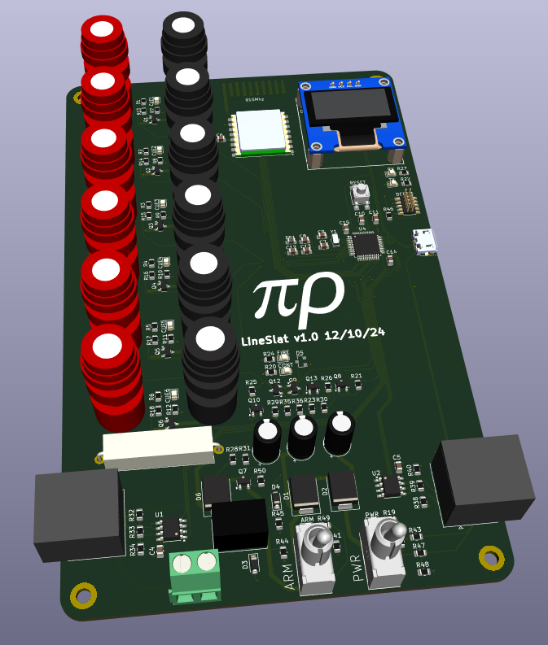

# LineSlat - Daisy-chained fireworks controllers for line effects

This is an ARM Cortex M0 board with:
* SAMD21 cpu
* USB for programming & serial debug
* Cortex Debug connector for bootloader install & hw debug
* 6 Pairs of PyroClips (6 cues per station)
* 2 RJ45 connectors for daisy-chaining (power & serial comm)
* 915MHz Hope RFM95 Lora module (only populated in the master station)
* OLED display

[Schematic pdf](v1.0/LineSlat.pdf)

